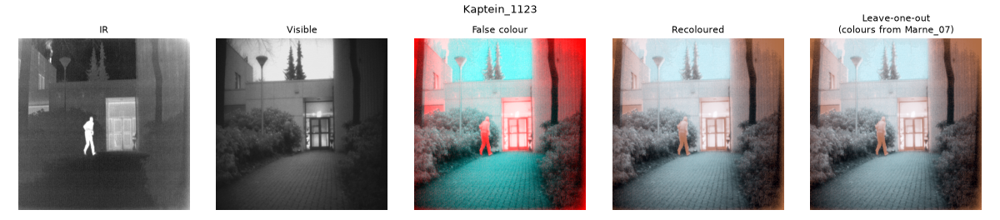
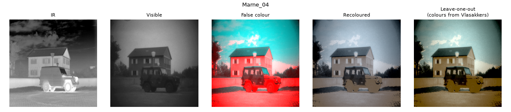

# Night-Vision Enhancement: IR + Visible Fusion with Colour Transfer

Night-time surveillance cameras produce two kinds of greyscale image:

* a **thermal (IR)** image, where warm people and vehicles stand out clearly
  but the background has little detail
* a **low-light visible** image, which has the background detail but hides
  anything in shadow

This project fuses the two into one image and gives it **natural daytime
colours**, so a human operator can read the scene at a glance. It was built
for the Image Processing & Computer Vision (IPCV) course at PES University.
The original is in MATLAB; there is also a Python port with tests and
objective metrics.




## How it works

```
 IR ──► piecewise contrast stretch ─┐
                                    ├─► DWT fusion (db2) ─► (fused + IR)/2 ─► R ┐
 VIS ─► histogram equalisation ─────┘                                          ├─► false-colour RGB
 VIS ──────────────────────────────────────────────────────────────────────► G,B ┘        │
                                                                                          ▼
                     daylight photo database ──► SIFT matching ──► best reference photo
                                                                                          │
                                                   Reinhard colour transfer in Lab  ◄─────┘
                                                                                          │
                                                                                          ▼
                                                                              recoloured image
```

1. **Contrast enhancement** – the IR image gets a piecewise-linear stretch
   (40→0, 200→255) that pushes hot targets to white. The visible image is
   histogram-equalised to lift detail out of dark regions.
2. **Wavelet fusion** – both images are decomposed with a single-level
   Daubechies-2 DWT. The low-frequency approximations are **averaged**, so
   overall brightness comes from both sensors. For the high-frequency details
   the **maximum** coefficient wins, which keeps edges from either sensor.
3. **False colour** – the fused result (averaged with the raw IR) goes in the
   red channel and the visible image in green and blue. Hot targets therefore
   show up red against a cyan background.
4. **Reference retrieval** – SIFT keypoints of the false-colour image are
   matched (Lowe ratio test) against every daylight photo in the dataset. The
   photo with the most matches is chosen.
5. **Colour transfer** – the image is converted to CIE-Lab. Each channel is
   shifted and scaled to match the mean and standard deviation of the
   reference photo ([Reinhard et al., 2001](https://doi.org/10.1109/38.946629)),
   then converted back to RGB.

## Results

`python run_all.py` processes all 23 scenes and writes one panel per scene to
[`results/scenes/`](results/scenes/), plus [`results/metrics.csv`](results/metrics.csv).

| Metric (mean over 23 scenes) | Visible input | Fused output |
|---|---:|---:|
| Entropy (bits) | 6.97 | **7.46** |
| Average gradient | 4.42 | **9.29** |
| Spatial frequency | 8.99 | **19.26** |

| Retrieval | Result |
|---|---|
| Scene's own daylight photo ranked first by SIFT | 9 / 22 scenes |

* The fused image carries more information (higher entropy) and more edge
  detail (roughly double the gradient and spatial frequency) than the visible
  frame alone. Part of the sharpness gain comes from histogram equalisation,
  which also amplifies sensor noise, so these no-reference metrics should be
  read alongside the images.
* The **leave-one-out** column in each panel removes the scene's own photo
  from the database, so its colours must come from a *different* location.
  Results stay plausible (sky stays blue, foliage stays green) because
  Reinhard transfer only moves global colour statistics.
* Retrieval is the weakest step. SIFT features from an IR/visible composite
  often match the wrong daylight photo. One photo (`pancake_house`) is
  chosen for 7 of the 23 scenes because it is very textured and produces many
  matches.
  Normalising the match count by the number of keypoints, or using a global
  descriptor, would be the next improvement.

## Running it

### Python (no MATLAB needed)

```bash
pip install -r requirements.txt
python run_all.py                      # all scenes -> results/
python run_all.py --scenes House Farm  # a subset
pytest                                 # unit tests + one end-to-end scene
```

```python
from nightvision import enhance
from nightvision.data import load_manifest, load_references, load_scene

manifest = load_manifest()
names, refs = load_references(manifest)
ir, vis = load_scene("House", manifest)
recoloured, false_colour, match = enhance(ir, vis, refs)
print("colours taken from", names[match.index])
```

### MATLAB (original implementation)

Requires the Image Processing and Wavelet toolboxes and
[VLFeat](https://www.vlfeat.org/install-matlab.html) for SIFT (check the
install with `vl_setup demo`).

```matlab
cd matlab
execute(1, 3)            % recolour every scene, save enhanced.png, show 3
execute_indi('House')    % one scene
```

To recolour your own pair of images:

```matlab
[rgbnames, ~] = get_filenames();
ir  = im2gray(imresize(imread(ir_path),  [400 400]));
vis = im2gray(imresize(imread(vis_path), [400 400]));
recoloured = enhance(ir, vis, rgbnames);
display_images(ir, vis, recoloured, figure());
```

## Repository layout

```
matlab/        original MATLAB implementation
nightvision/   Python port: pipeline.py, data.py, metrics.py
run_all.py     batch run + metrics -> results/
tests/         pytest suite (run in GitHub Actions)
data/          23 registered IR / visible / daylight scenes + dataset.json
results/       output panels and metrics
docs/          literature review
```

## Dataset

The scenes come from the
[TNO Multiband Image Data Collection](https://doi.org/10.6084/m9.figshare.1008029)
(CC BY 4.0) and the
[TRICLOBS dynamic multi-band image dataset](https://doi.org/10.6084/m9.figshare.3206887)
(CC0, [paper](https://doi.org/10.1371/journal.pone.0165016)), both by
A. Toet et al., TNO. Each folder in `data/` holds registered images of one
scene:

| Suffix | Sensor |
|---|---|
| `_IR`, `LWIR` | long-wave thermal infrared |
| `_Vis`, `VIS` | visible / low-light camera |
| `_II`, `NIR` | image intensifier / near infrared |
| `_REF`, `photo` | daylight colour photo of the same place (the colour database) |

The images are stored as lossless PNG; the originals were BMP/TIFF.
`dataset.json` maps each scene to its IR, visible and reference images.
Veluwe has no daylight photo, so it is recoloured but never used as a
reference.

## Background reading

See [docs/literature-review.md](docs/literature-review.md) for summaries of
the papers behind the design: IR/visible fusion for night-vision context
enhancement (Zhou et al., 2016), low-light object detection (Xiao & Jiang,
2020) and how night vision devices work.

## Team and credits

Built by Royston, Amruth, Siddharth and Mayuravarsha as the IPCV course
project at PES University.

Third-party code in `matlab/`: `color_transfer.m` is by Mahmoud Afifi, and
`progressBar.m` is by Steve Hoelzer (MATLAB File Exchange).
